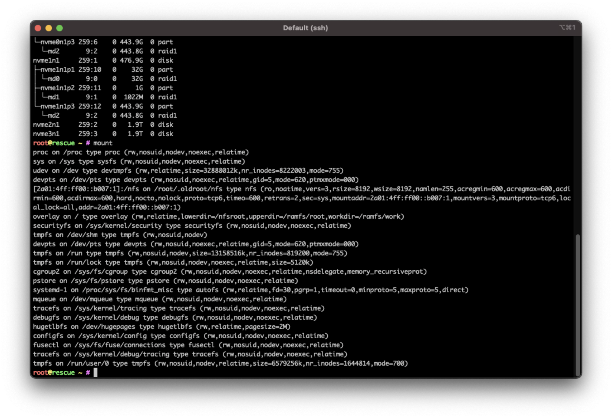

# Big backup server guide

So from a dedicated service provider you can rent a rescue image and here is how you can set up ubuntu OS on to the system.

```javascript
installimage
```


1. once you select ubuntu there will be blue screen with some disk configs this is important .. we have to make some changes there
2. select ubuntu 2004 3rd one


```javascript
config files by commenting out DRIVE3 DRIVE4 by using # 

SWRAIDLEVEL1 

& HOSTNAME to whatever is suited to the build
```


Touchbar on mac click on server window, fn then f2 save then f10 exit.


Continue with YES. Once system will be deployed you can see with

```javascript
lsblk

///then

mount

```



```javascript
reboot
```


If you need to re-do ssh key you need to remove the IP of server the known host from known\_hosts so it can write the server again

`nano /users/local/.ssh/known_hosts`

input SSH password again


Log back in to Service, should now see the hostname implemented

Update system

```javascript
sudo apt update && sudo apt upgrade -y && sudo apt autoremove -y

reboot
```

install Firewall

```javascript
sudo apt install ufw
```

Now configure some basic rules to allow only ssh and outgoing traffic.

```javascript
sudo ufw limit ssh/tcp comment 'Rate limit for openssh server' 
sudo ufw default deny incoming
sudo ufw default allow outgoing
sudo ufw enable
```


Enable must be the last one, so all rules will be added and firewall enabled.


```javascript
reboot
```

#### The set up for this server is as follows.&#x20;

2x 512GB - configured in RAID 1 (Mirror) - they contain operating system and if one fails second will handle OS operations&#x20;

2x 1.92TB - unconfigured. we are about to crate partitions on them and configure those disks for auto-mount


