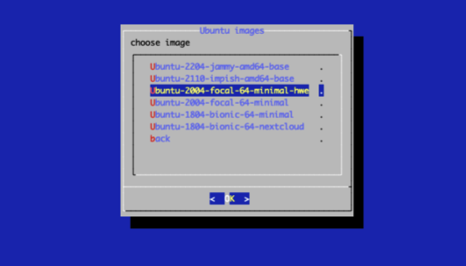
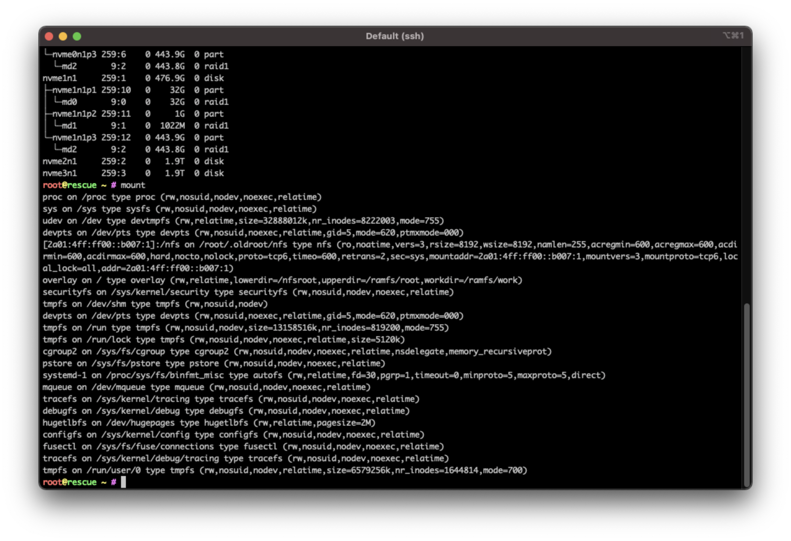

# Big backup server guide

So from a dedicated service provider you can rent a rescue image and here is how you can set up ubuntu OS on to the system.

```javascript
installimage
```


1. once you select ubuntu there will be blue screen with some disk configs this is important .. we have to make some changes there
2. select ubuntu 2004 3rd one



```javascript
config files by commenting out DRIVE3 DRIVE4 by using # 

SWRAIDLEVEL1 

& HOSTNAME to whatever is suited to the build
```


Touchbar on mac click on server window, fn then f2 save then f10 exit.


Continue with YES. Once system will be deployed you can see with

```javascript
lsblk

///then

mount

```



```javascript
reboot
```


If you need to re-do ssh key you need to remove the IP of server the known host from known\_hosts so it can write the server again

`nano /users/local/.ssh/known_hosts`

input SSH password again


Log back in to Service, should now see the hostname implemented

Update system

```javascript
sudo apt update && sudo apt upgrade -y && sudo apt autoremove -y

reboot
```

install Firewall

```javascript
sudo apt install ufw
```

Now configure some basic rules to allow only ssh and outgoing traffic.

```javascript
sudo ufw limit ssh/tcp comment 'Rate limit for openssh server' 
sudo ufw default deny incoming
sudo ufw default allow outgoing
sudo ufw enable
```


Enable must be the last one, so all rules will be added and firewall enabled.


```javascript
reboot
```

#### The set up for this server is as follows.&#x20;

2x 512GB - configured in RAID 1 (Mirror) - they contain operating system and if one fails second will handle OS operations&#x20;

2x 1.92TB - unconfigured. we are about to crate partitions on them and configure those disks for auto-mount


Our usual configured set up is to create /mnt folder so I would suggest we go with

`/mnt/vol1 /mnt/vol2`

but first let's partition them

```javascript
fdisk /dev/nvme2n1

n
P
1
ENTER
ENTER
w
```


repeat steps for `fdisk /dev/nvme3n1`


What we did on those disks... partition defines amount of space on disk dedicated for single file system... we created partition that covers whole disk space on each of 2 disks

now it is time to make this space usable - format disk with file system

```javascript
mkfs.ext4 /dev/nvme2n1p1
mkfs.ext4 /dev/nvme3n1p1

df -k
```

> at the moment you will not see those 2TB disks yet

Once you have folders created then we can mount volumes

```javascript
mkdir /mnt/vol1
mkdir /mnt/vol2

mount /dev/nvme2n1p1 /mnt/vol1
mount /dev/nvme3n1p1 /mnt/vol2
```


Check they are mounted

```javascript
df -k 
```

We need to make sure that linux will mount them each time it will start

```javascript
sudo /etc/fstab
more /etc/fstab

blkid
```


Add few lines to etc/fstab

```javascript
nano /etc/fstab

# /dev/nvme2n1p1
UUID=8e274ead-a0c0-42bd-8cd2-3d7dc354f6be /mnt/vol1 ext4 defaults 0 0
# /dev/nvme3n1p1
UUID=6d999d6f-b033-4bd8-813a-284542fcff70 /mnt/vol2 ext4 defaults 0 0
mount -a
```

```
reboot
```

#### What we have did so far.

1. Installed custom ubuntu 20.04
2. Created RAID1 volume (Mirror) for operating system during installation (2x 512GB)
3. Once operating system ready partitions were created on 2TB disks (fdisk)
4. Partitions were formatted then with ext4 filesystem (mkfs.ext4)
5. Newly created partitions mounted in /mnt/volX
6. Both new partitions added to /etc/fstab, so they will be automatically mounted when system starts


once system is back you can check if partitions are mounted with

```javascript
//This should display 2x 2TB volumes
df -k
```


Update box.

```javascript
apt update && apt upgrade -y && apt autoremove -y
```


### Install GO

```bash
GOVER=$(curl <https://go.dev/VERSION?m=text>)
wget <https://golang.org/dl/${GOVER}.linux-amd64.tar.gz>
sudo rm -rf /usr/local/go && sudo tar -C /usr/local -xzf ${GOVER}.linux-amd64.tar.gz
```

<pre class="language-javascript"><code class="lang-javascript"><strong>adduser comdex </strong></code></pre>


```javascript
///add user to sudo
usermod -aG sudo <username>

su - comdex

nano .profile

///add these lines to the end of the .profile 

	# add environmental variables for Go
if [ -f "/usr/local/go/bin/go" ] ; then
    export GOROOT=/usr/local/go
    export GOPATH=${HOME}/go
    export GOBIN=$GOPATH/bin
    export PATH=${PATH}:${GOROOT}/bin:${GOBIN}
fi

///to save
cmd x 

enter
```


Lets see whats in home

```bash
ls -l /home
```

#### Prepare for Chain build

1. move /home/comdex folder to data volume
2. create link in /home to data volume
3. change context to comdex user
4. build cosmovisor
5. build comdex binaries

move folder


```javascript
///move folder to mount storage
mv /home/comdex /mnt/vol1

///create s-link
ln -s /mnt/vol1/comdex /home/comdex

///see if link was created 
ls -l /home

///log into user
su - comdex

///check to see if GO env variables are good
go version

///back to root
ctrl-d
```

#### Tooling

```javascript
apt install build-essential git gcc make

///log back in to user
```


### Deploy cosmovisor

1. **Cosmovisor build**

```javascript
cd ${HOME}
git clone <https://github.com/cosmos/cosmos-sdk> && cd cosmos-sdk/cosmovisor/
make

///we make the correct folders 
mkdir -p ${HOME}/.comdex/cosmovisor/genesis/bin
```

```bash
```

Get the binary in place

```bash
cd
git clone <https://github.com/comdex-official/comdex.git>
cd comdex
git fetch --tags
git checkout v0.0.3
make install
```

**2. Cosmovisor binaries**

mv `cosmovisor` to it's destination folder


```javascript
///find the visor binary
sudo find / -name cosmovisor

///make directory for visor to live
mkdir -p ${HOME}/.local/bin

///place visor binary in new location
cp cosmovisor ${HOME}/.local/bin

///check to see if its there 
ls ${HOME}/.local/bin

```

```javascript
///Check to see if its in bin..
ls ${HOME}/.local/bin
```

#### (FOR COMDEX ONLY)

follow repo and up grade to .4

```javascript
cd ${HOME}/comdex
git fetch --tags
git checkout v0.0.4
make install

///initialise the node
comdex init "{{NODE_NAME}}" --chain-id comdex-1
```


#### Cosmovisor prep

```javascript
///locate binary
ls -l ${HOME}/go/bin

///mv to cosmosvisor genesis dir
cp ${HOME}/go/bin/binary ${HOME}/.chain/cosmovisor/genesis/bin
```


Now it's time to place proper genesis in config folder, so node will be in proper chain

```bash
rm ${HOME}/.comdex/config/genesis.json
curl <https://raw.githubusercontent.com/comdex-official/networks/main/mainnet/comdex-1/genesis.json> > ${HOME}/.comdex/config/genesis.json
```


#### Peers & Seeds

add peers & seeds from instructions

```javascript
///Add to shell
PEERS="$(curl -s "<https://raw.githubusercontent.com/KiFoundation/ki-networks/v0.1/Testnet/kichain-t-4/peers.txt")">

///Run the command to impletment to config.toml
sed -i.bak -e "s/^persistent_peers *=.*/persistent_peers = \\"$PEERS\\"/" $HOME/.kid/config/config.tom
```

```bash
seeds = "08ab4552a74dd7e211fc79432918d35818a67189@52.69.58.231:26656,449a0f1b7dafc142cf23a1f6166bbbf035edfb10@13.232.85.66:26656,5b27a6d4cf33909c0e5b217789e7455e261941d1@15.222.29.207:26656"
```

#### Checkout our state-sync intructions by following [here.](https://app.gitbook.com/o/qY7noVnVnux1PDe9cG1g/s/imXSSnZkS06jq5Lqf13A/\~/changes/jJ9yp3kmYk8lvH3kf2pl/chains/chain-services/statsync/comdex)

#### Ports

in this section we show you a way on running multiple nodes on one server. This not configured properly can cause some flakey behaviour between chains. We reccomened you have a port system for each of you nodes. Here is an example below.

```bash
cd ${HOME}/.comdex/config
```

At the moment we have default ports in configuration. We need to change this as there will be more nodes on same server. We will add and increment of 100 to each port value refer to an excell sheet and run config command by adding 10 to it .


So while you are in `./comdex/config` we can then roll all changes

```bash
sed -i "s/laddr = \\"tcp:\\/\\/127.0.0.1:26657\\"/laddr = \\"tcp:\\/\\/127.0.0.1:26757\\"/g" config.toml
sed -i "s/address = \\"0.0.0.0:9090\\"/address = \\"0.0.0.0:9190\\"/g" app.toml
sed -i "s/address = \\"0.0.0.0:9091\\"/address = \\"0.0.0.0:9191\\"/g" app.toml
sed -i "s/laddr = \\"tcp:\\/\\/0.0.0.0:26656\\"/laddr = \\"tcp:\\/\\/0.0.0.0:26756\\"/g" config.toml
sed -i "s/address = \\"tcp:\\/\\/0.0.0.0:1317\\"/address = \\"tcp:\\/\\/0.0.0.0:1417\\"/g" app.toml
sed -i "s/proxy_app = \\"tcp:\\/\\/127.0.0.1:26658\\"/proxy_app = \\"tcp:\\/\\/127.0.0.1:26758\\"/g" config.toml
sed -i "s/prometheus_listen_addr = \\":26660\\"/prometheus_listen_addr = \\":26760\\"/g" config.toml
sed -i "s/pprof_laddr = \\"localhost:6060\\"/pprof_laddr = \\"localhost:6160\\"/g" config.toml
```

<figure><figcaption></figcaption></figure>

You can check all ports and which process uses which port

```bash
netstat -tlpn
```

#### Summary

1. home folder moved
2. cosmovisor built
3. binaries built and placed
4. config adjusted for statesync
5. config adusted with new port numbers

#### What's left?

1. define service
2. Spin this bitch !!!&#x20;

### Service file

```javascript
///back to root
cntl-d
```

and then we define service

```javascript
///define service
nano /lib/systemd/system/comdex.service
```

```javascript
Unit]
Description=Comdex Backup Node (Cosmovisor)
After=network-online.target

[Service]
User=comdex
Group=comdex
ExecStart=/home/chihuahua/.comdex/bin/cosmovisor run start
Restart=always
RestartSec=3
LimitNOFILE=4096
Environment="DAEMON_NAME=comdex"
Environment="DAEMON_HOME=/home/comdex/.comdex"
Environment="DAEMON_ALLOW_DOWNLOAD_BINARIES=false"
Environment="DAEMON_RESTART_AFTER_UPGRADE=true"
Environment="DAEMON_LOG_BUFFER_SIZE=512"
///we skip back ups on main validators just so we get back online faster. 
///When it comes to our back-up servers this is where we do take a snapshot 
///after any upgrades, incase we need to roll back.
Environment="UNSAFE_SKIP_BACKUP=false"

[Install]
WantedBy=multi-user.target
```

```javascript
systemctl daemon-reload

systemctl start comdex

journalctl -u comdex -f
```


Once chain is syncd make sure storage is evenly spread


```bash
df -k 
```


How to show running services


```javascript
systemctl list-units --type=service
```


